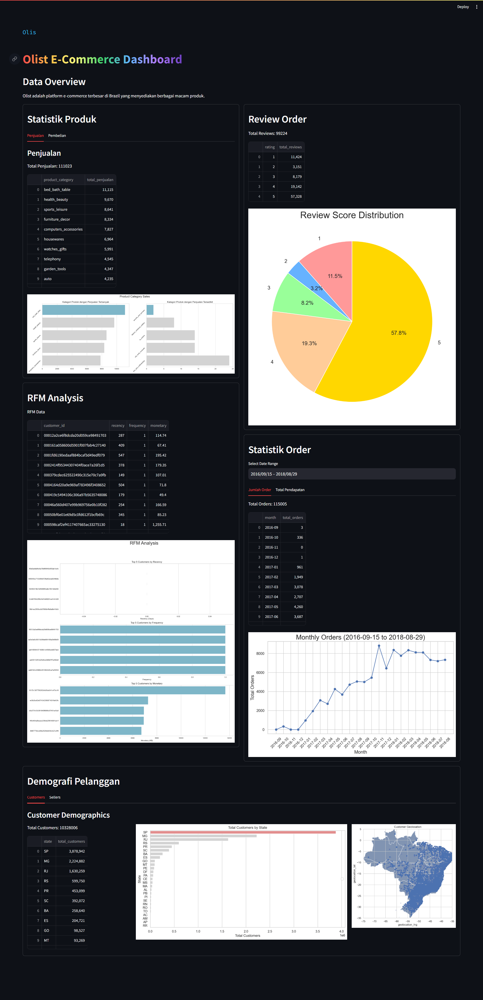

# Brazilian E-Commerce Dashboard ✨

## Overview
This is a simple dashboard to visualize the Brazilian E-Commerce dataset. The dataset contains 100k orders from 2016 to 2018 made at multiple marketplaces in Brazil. It was originally published on [Kaggle](https://www.kaggle.com/olistbr/brazilian-ecommerce).

## Setup environment
```bash
conda create --name main-ds python=3.9
conda activate main-ds
pip install -r requirements.txt
```

## Run steamlit app
```bash
streamlit run dashboard.py
```

## Dashboard Preview
